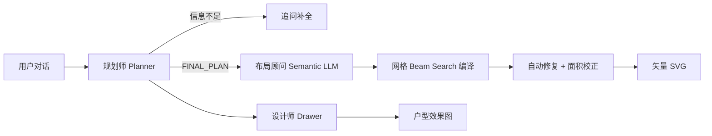

# FloorPlanWeaver

**多智能体户型平面交互设计平台** — 用自然语言描述需求，由规划师、布局顾问与设计师协作，生成可执行的户型方案与平面图。

<p align="center">
  
  
  
  
  
</p>

---

## 功能概览

| 模块 | 角色 | 能力 |
|------|------|------|
| **Planner** | 规划师 | 最多追问 1～2 轮后出方案并出图；输出房间清单、面积与动线 |
| **Layout** | 布局顾问 + 工程师 | LLM 仅输出语义约束 → 网格 beam search 布置 → 规则校验填满轮廓（非 LLM 直接画几何） |
| **Drawer** | 设计师 | 根据最终方案生成多模态户型效果图（可选，纯图形无文字） |

前端提供：

- 需求对话与快捷模板
- **多环节思考进度**（规划师 / 布局顾问 / 布局工程师 / 设计师）
- **正交外轮廓编辑器**（网格吸附、点击闭合、顶点拖拽）
- 规划方案预览、矢量 / 多模态双视图
- SVG 自适应字体渲染（前端直接渲染，中文字体完美显示）

---

## 一键启动（推荐）

使用项目根目录启动脚本，自动拉起后端、前端并打开浏览器：

```powershell
# Windows（推荐使用 Anaconda Agent 环境）
E:\ananconda\envs\Agent\python.exe run.py
```

| 服务 | 地址 |
|------|------|
| 前端 | http://localhost:3001 |
| 后端 API | http://localhost:8000 |
| 健康检查 | http://localhost:8000/api/v1/health |

`run.py` 会优先使用 `E:\ananconda\envs\Agent\python.exe`，启动前自动尝试释放 **8000 / 3001** 端口。

---

## 项目结构

```
FloorPlanWeaver/
├── run.py                 # 一键启动前后端
├── backend/
│   ├── app/
│   │   ├── agents/        # Planner / Layout / Drawer 提示与解析
│   │   ├── api/           # FastAPI 路由
│   │   ├── orchestrator/  # 会话工作流编排
│   │   ├── renderers/     # SVG 渲染器（自适应字体 + 精确标签定位）
│   │   ├── schemas/       # Pydantic 模型
│   │   └── services/      # 规划、布局编译、后处理、LLM 客户端、记忆管理
│   └── tests/             # pytest（113 个测试用例）
└── frontend/
    ├── app/               # Next.js 页面
    ├── components/        # 对话、轮廓编辑器、方案、平面图、思考流水线 UI
    └── lib/               # API、布局/规划归一化、多边形渲染、流水线阶段定义
```

---

## 手动启动

### 1. 后端

```bash
cd backend
copy .env.example .env    # Windows；Linux/macOS 用 cp
pip install -r requirements.txt
uvicorn app.main:app --host 0.0.0.0 --port 8000 --reload
```

`.env` 常用项：

```ini
PLANNER_USE_LLM=true
DRAWER_USE_LLM=true
LLM_API_BASE=https://your-llm-gateway/v1
LLM_API_KEY=sk-...
PLANNER_MODEL=your-planner-model
# 规划师最多追问轮数（1=追问一次后强制出图；2=最多两轮追问）
PLANNER_MAX_ASK_ROUNDS=1
DRAWER_MODEL=your-drawer-model
LAYOUT_USE_GRID_COMPILER=true
```

### 2. 前端

```bash
cd frontend
npm install
npm run dev
```

默认连接 `http://localhost:8000/api/v1`，可通过 `NEXT_PUBLIC_API_BASE` 覆盖。

---

## 多智能体流水线



### 矢量布局（方法 A — Grid Search）

1. **语义层**：LLM 输出 `center_x/y`、`width_ratio/height_ratio` 等归一化位置与大小（非绝对坐标）
2. **网格搜索层**：0.25m 精度网格，Beam Search（宽度 16）+ 贪心回退放置所有房间
3. **自动修复**：面积双向校正、矩形化强制（卫生间/卧室/阳台/厨房保证轴对齐矩形）、碎片吸收、灵活房间补偿
4. **几何校验**：覆盖率、无重叠、无间隙、连通性、矩形约束、边界贴合、邻接关系
5. **多边形导出**：矩形房间用 bbox、异形房间用 boundary polygonization

### 房间矩形保证

以下房间类型强制输出为轴对齐矩形：**卫生间、卧室、阳台、厨房**。通过 `_force_rect` 从灵活房间（客厅、餐厅等）回收网格单元实现。被夺取的灵活房间会通过 BFS 从附近空闲区域获得等量补偿。

### 绘图方式

| 模式 | 说明 |
|------|------|
| `vector` | 仅矢量布局（方法 A） |
| `multimodal` | 仅多模态出图（方法 B，纯图形无文字） |
| `both` | 同时生成 A + B |

---

## 跨轮记忆与偏好系统

平台支持**跨轮对话记忆**，用户在对话中提到的偏好和需求会被自动提取并持续保留：

### 工作记忆架构

| 组件 | 功能 |
|------|------|
| `collected_requirements` | 结构化工作记忆（户型、面积、朝向、房间清单） |
| `user_preferences` | 软偏好列表（有老人、有宠物、干湿分离、主卧要大等） |
| `conversation_summary` | 最近对话摘要，供 LLM 上下文参考 |
| `apply_delta_to_memory()` | 从当前消息 + 历史消息中提取并合并偏好 |
| `merge_snapshot()` | 去重合并新信息到持久化记忆 |

### 支持的偏好模式（22 种）

- **居住者**：有老人居住、有小孩、有宠物
- **空间要求**：主卧要宽敞、客厅要大、厨房要大、需要书房、需要衣帽间、需要玄关
- **设计偏好**：干湿分离、动静分离、南北通透、采光充足、通风良好、无障碍设计
- **特殊设施**：厨房要放岛台、步入式衣柜、居家办公区、主卧带独卫

### 修改意图检测

系统能识别用户的修改指令（如"请将厨房移动至右下角"），不会覆盖已有的房间列表，而是：
- 保留所有已提取的房间信息
- 提取位置约束注入到对应房间的 `notes`（如"用户要求：右下角"）
- 位置约束通过 `_extract_prefer_edge` 转换为布局引擎用的 edge 标签

### 复合房间名匹配

房间提取支持**复合名优先匹配**和**位置去重**：
- "客餐厅一体" → 匹配为 `客餐厅`（22㎡），不会额外匹配 `客厅` 和 `餐厅`
- "卧室" → 匹配为 `卧室`（14㎡），与 `主卧`/`次卧` 并列
- "客餐厅"、"起居室" 等不在标准模板中的类型也能正确处理

### 多轮对话示例

```
用户: 我要三居室住宅          → 提取 layout_type=三居, building_type=住宅
用户: 120平，有老人和小孩     → 提取 target_area=120, preferences=[有老人, 有小孩]
用户: 主卧要大，需要书房，南向 → 提取 orientation=南向, preferences+=[主卧宽敞, 需要书房]
                                     ↑ 之前轮次的偏好仍保留
```

所有偏好会融入规划师的 `design_goals`、`drawing_brief` 和 `lifestyle_tags`。

---

## 外轮廓编辑器

前端提供功能完善的 SVG 正交外轮廓编辑器：

| 功能 | 说明 |
|------|------|
| 正交绘制 | 线段自动吸附为水平/垂直，保证所有角为直角 |
| 网格吸附 | 所有坐标吸附到 0.25m 网格，与后端布局引擎精度一致 |
| 点击闭合 | 绘制 3 个以上顶点后，靠近起点点击即可闭合多边形 |
| 顶点拖拽 | 切换到"选择"工具可拖拽任意顶点调整外轮廓 |
| 预设模板 | 矩形 80/100/120/140㎡、L 形 100㎡、T 形 120㎡ |
| 自定义尺寸 | 输入宽×高直接生成矩形轮廓 |
| 边长标注 | 每条边显示精确长度（0.01m 精度） |
| 直角标记 | 正交模式下显示直角符号 |
| 撤销/清空 | 支持撤销最后一个顶点和清空所有顶点 |
| 缩放/平移 | 滚轮缩放，Shift+拖拽平移 |

---

## SVG 渲染

前端使用 React SVG 直接渲染布局，确保中文完美显示：

- **自适应字体**：根据房间面积分 4 档字体大小（≥14㎡/≥8㎡/≥4㎡/<4㎡），小于 3㎡ 的房间只显示名称
- **精确标签定位**：`polygonLabelCenter` 算法确保标签始终在房间内部，不重叠
- **动态 viewBox**：自动计算所有顶点范围，添加 padding 确保不裁剪
- **中文完美支持**：使用系统字体栈（Microsoft YaHei / PingFang SC / Noto Sans SC）
- **多模态绘图无文字**：方法 B 出图提示词明确禁止任何文字标注，仅以颜色分区和墙体线条表达

---

## 前端：思考进度 UI

请求进行中时，对话区会展示**多智能体协作**时间线，顶部状态栏同步当前环节，例如：

- 规划师思考中
- 布局顾问分析中
- 布局工程师编译中
- 布局优化中
- 设计师绘图中

环节列表随「绘图方式」自动增减；完成后状态栏显示各 Agent 执行摘要。

---

## 测试

```bash
cd backend
E:\ananconda\envs\Agent\python.exe -m pytest tests/ -q
```

```bash
cd frontend
npx tsc --noEmit
```

113 个后端测试覆盖：
- 跨轮记忆与偏好提取（`test_cross_turn_memory.py`，13 个用例）
- 修改意图检测与位置约束（`test_modification_memory.py`，16 个用例）
- 房间提取边界场景（`test_room_extraction.py`，6 个用例）
- 记忆合并与快照（`test_requirement_memory.py`）
- 规划师多轮对话（`test_planner_memory_flow.py`）
- 网格搜索布局几何正确性（`test_grid_geometry.py`）
- 9 房间完整布局覆盖（`test_vector_layout_coverage.py`）
- API 集成全链路（`test_chat_integration.py`）
- SVG 绘制提示词（`test_drawer_prompt.py`）

---

## 常见问题

**Q: 界面提示 `PlannerAskForMore` 校验错误？**
A: 已在后端对 LLM 残缺 JSON 做补全与回退。请**完全重启** `run.py` 或 uvicorn，避免旧进程未加载新代码。

**Q: 端口被占用？**
A: 使用 `run.py` 会自动尝试释放 8000/3001；或手动 `netstat` + `taskkill` 结束占用进程。

**Q: 矢量图房间数为 0 或报错？**
A: 前端已用 `normalizeLayout()` 适配后端嵌套 `layout.layout.rooms` 结构，请拉取最新前端代码。

**Q: 房间超出轮廓或有间隙？**
A: 网格搜索编译器（`compile_method=grid_search`）已确保几何正确性：房间不超出外轮廓、内部紧密贴合、关键房间强制矩形。后处理跳过 `grid_search` 结果以保持精度。

**Q: 卫生间/卧室/阳台不是矩形？**
A: `_force_rect` 会从灵活房间（客厅、餐厅）中回收单元格，强制上述房间为轴对齐矩形。被夺取的灵活房间会通过 BFS 补偿等量面积。

**Q: 提示 `LLM 调用失败: The read operation timed out`？**
A: 模型响应慢，默认硬限制 120s（`LLM_HARD_TIMEOUT_SECONDS`）。请重启后端重试；仍慢可换 `*-Flash` 模型或检查 `LLM_API_BASE` 网络。

**Q: 多轮对话还要重复说面积/户型？**
A: 已启用**跨轮工作记忆**：同一会话内自动合并 `collected_requirements` 与 `user_preferences`，规划师 LLM 接收最近 8 轮对话 + 需求快照 + 用户偏好 + 对话摘要。

**Q: 之前说的偏好（如"有老人"）会被记住吗？**
A: 会。`apply_delta_to_memory()` 会扫描最近 6 条历史消息提取偏好，并通过 `merge_snapshot()` 去重合并到持久化记忆中，无需重复说明。

**Q: 修改需求（如"把厨房移到右下角"）会丢失之前的房间信息吗？**
A: 不会。系统会检测修改意图，保留所有已提取的房间，只注入位置约束。修改指令不会覆盖 `room_program`。

**Q: SVG 中文显示为方块或空白？**
A: 已修复。前端使用 React SVG 直接渲染（非内嵌 base64），使用系统字体栈（Microsoft YaHei / PingFang SC / Noto Sans SC），中文完美显示。

**Q: 规划师漏掉了卧室等房间？**
A: 已修复。房间提取支持"卧室"（14㎡）、"客餐厅"（22㎡）等复合名，复合名优先匹配避免重复。例如"一室一厅，需要卧室、客餐厅一体"会正确提取 5 个房间。

**Q: 关闭后对话还会保留吗？**
A: 关闭页面（`pagehide`）或点击「关闭服务」时，会调用 `/sessions/{id}/end` 删除服务端会话（含全部消息与方案），并清除浏览器 `localStorage` 中的 sessionId。下次打开为全新会话。

---

## 技术栈

- **后端**：FastAPI · Pydantic v2 · 自研网格 Beam Search 布局编译器 · OpenAI 兼容 LLM 网关 · 跨轮记忆系统 · 修改意图检测
- **前端**：Next.js 14 · React · TypeScript · Tailwind CSS · SVG 正交轮廓编辑器 · 自适应字体渲染

---

## 许可证

MVP 演示项目，仅供学习与内部验证使用。
