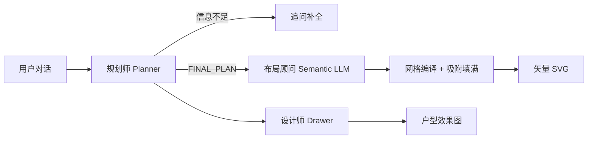

# FloorPlanWeaver

**多智能体户型平面交互设计平台** — 用自然语言描述需求，由规划师、布局顾问与设计师协作，生成可执行的户型方案与平面图。

<p align="center">
  
  
  
  
</p>

---

## 功能概览

| 模块 | 角色 | 能力 |
|------|------|------|
| **Planner** | 规划师 | 最多追问 1～2 轮后出方案并出图；输出房间清单、面积与动线 |
| **Layout** | 布局顾问 + 工程师 | LLM 仅输出语义约束 → 网格 beam 搜索布置 → 规则校验填满轮廓（非 LLM 直接画几何） |
| **Drawer** | 设计师 | 根据最终方案生成多模态户型效果图（可选） |

前端提供：

- 需求对话与快捷模板
- **多环节思考进度**（规划师 / 布局顾问 / 布局工程师 / 设计师）
- 外轮廓编辑、规划方案预览、矢量 / 多模态双视图

---

## 一键启动（推荐）

使用项目根目录启动脚本，自动拉起后端、前端并打开浏览器：

```powershell
# Windows（推荐使用 Anaconda Agent 环境）
E:\ananconda\envs\Agent\python.exe run.py
```

| 服务 | 地址 |
|------|------|
| 前端 | http://localhost:3001 |
| 后端 API | http://localhost:8000 |
| 健康检查 | http://localhost:8000/api/v1/health |

`run.py` 会优先使用 `E:\ananconda\envs\Agent\python.exe`，启动前自动尝试释放 **8000 / 3001** 端口。

---

## 项目结构

```
FloorPlanWeaver/
├── run.py                 # 一键启动前后端
├── backend/
│   ├── app/
│   │   ├── agents/        # Planner / Layout / Drawer 提示与解析
│   │   ├── api/           # FastAPI 路由
│   │   ├── orchestrator/  # 会话工作流编排
│   │   ├── schemas/       # Pydantic 模型
│   │   └── services/      # 规划、布局编译、后处理、LLM 客户端
│   └── tests/             # pytest（含 API 集成测试）
└── frontend/
    ├── app/               # Next.js 页面
    ├── components/        # 对话、轮廓、方案、平面图、思考流水线 UI
    └── lib/               # API、布局/规划归一化、流水线阶段定义
```

---

## 手动启动

### 1. 后端

```bash
cd backend
copy .env.example .env    # Windows；Linux/macOS 用 cp
pip install -r requirements.txt
uvicorn app.main:app --host 0.0.0.0 --port 8000 --reload
```

`.env` 常用项：

```ini
PLANNER_USE_LLM=true
DRAWER_USE_LLM=true
LLM_API_BASE=https://your-llm-gateway/v1
LLM_API_KEY=sk-...
PLANNER_MODEL=your-planner-model
# 规划师最多追问轮数（1=追问一次后强制出图；2=最多两轮追问）
PLANNER_MAX_ASK_ROUNDS=1
DRAWER_MODEL=your-drawer-model
LAYOUT_USE_GRID_COMPILER=true
```

### 2. 前端

```bash
cd frontend
npm install
npm run dev
```

默认连接 `http://localhost:8000/api/v1`，可通过 `NEXT_PUBLIC_API_BASE` 覆盖。

---

## 多智能体流水线



### 矢量布局（方法 A）

1. **语义层**：LLM 输出 `center_x/y`、`width_ratio/height_ratio` 等归一化位置与大小（非绝对坐标）
2. **编译层**：0.25m 网格放置固定/灵活房间，BFS 填充空闲单元
3. **后处理**：裁剪重叠、邻接吸附、扩展占满外轮廓

### 绘图方式

| 模式 | 说明 |
|------|------|
| `vector` | 仅矢量布局（方法 A） |
| `multimodal` | 仅多模态出图（方法 B） |
| `both` | 同时生成 A + B |

---

## 前端：思考进度 UI

请求进行中时，对话区会展示**多智能体协作**时间线，顶部状态栏同步当前环节，例如：

- 规划师思考中
- 布局顾问分析中
- 布局工程师编译中
- 布局优化中
- 设计师绘图中

环节列表随「绘图方式」自动增减；完成后状态栏显示各 Agent 执行摘要。

---

## 测试

```bash
cd backend
E:\ananconda\envs\Agent\python.exe -m pytest tests/ -q
```

```bash
cd frontend
npx tsc --noEmit
```

集成测试覆盖：残缺 LLM Planner JSON、`/chat` 全链路、布局语义与吸附逻辑。

---

## 常见问题

**Q: 界面提示 `PlannerAskForMore` 校验错误？**  
A: 已在后端对 LLM 残缺 JSON 做补全与回退。请**完全重启** `run.py` 或 uvicorn，避免旧进程未加载新代码。

**Q: 端口被占用？**  
A: 使用 `run.py` 会自动尝试释放 8000/3001；或手动 `netstat` + `taskkill` 结束占用进程。

**Q: 矢量图房间数为 0 或报错？**  
A: 前端已用 `normalizeLayout()` 适配后端嵌套 `layout.layout.rooms` 结构，请拉取最新前端代码。

**Q: 网格房间略超出轮廓？**  
A: 网格单元 bbox 可能略大于实际占格；`compile_method=grid` 时验证器会跳过部分多边形边界检查。

**Q: 提示 `LLM 调用失败: The read operation timed out` 或 `'tuple' object cannot be interpreted as an integer`？**  
A: 前者为模型响应慢；后者为 Windows/Python3.10 下 `urllib` 不支持 `(连接,读取)` 双超时元组（已修复为单一 timeout）。默认**硬限制 120s**（`LLM_HARD_TIMEOUT_SECONDS`），含重试总时长不超过 2 分钟。请**重启后端**后重试；仍慢可换 `*-Flash` 模型或检查 `LLM_API_BASE` 网络。

**Q: 多轮对话还要重复说面积/户型？**  
A: 已启用 P0 **工作记忆**：同一会话内自动合并 `collected_requirements`，规划师 LLM 接收最近 8 轮对话 + 需求快照；会话默认写入 `backend/data/sessions.db`（`SESSION_STORE=sqlite`）。重启后端后使用同一 `session_id` 仍可恢复（前端需保留 sessionId，如 localStorage）。

**Q: 关闭后对话还会保留吗？**  
A: 关闭页面（`pagehide`）或点击「关闭服务」时，会调用 `/sessions/{id}/end` 删除服务端会话（含全部消息与方案），并清除浏览器 `localStorage` 中的 sessionId。下次打开为全新会话。

---

## 技术栈

- **后端**：FastAPI · Pydantic v2 · 自研网格布局编译器 · OpenAI 兼容 LLM 网关
- **前端**：Next.js 14 · React · TypeScript · Tailwind 风格自定义组件

---

## 许可证

MVP 演示项目，仅供学习与内部验证使用。
